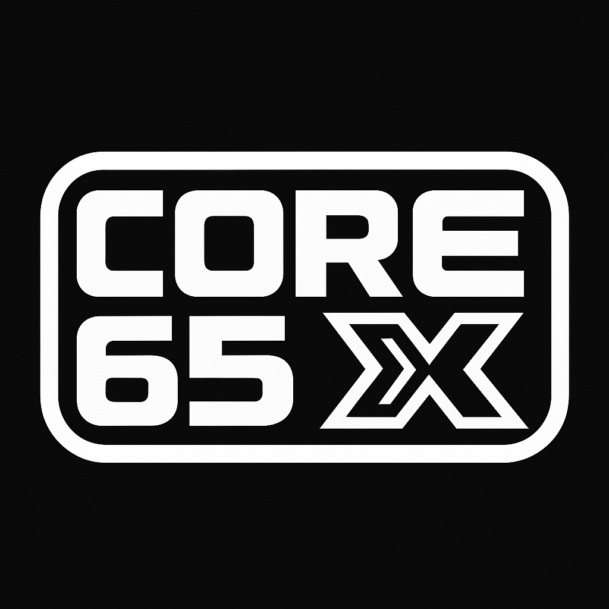

  

<h1 align="center">Core65X</h1>

<em>A modular 6502 devboard with retro soul & modern control.</em>

---

> ✨ Designed for makers, learners, educators, and retro freaks.

---

# Core65X – A Modular 8-Bit Retrocomputer System

Welcome to the `Core65X` project, a fully documented, modular 6502 platform for learning, experimenting, and retro enthusiasm. The **Core65X** is a handcrafted, modular retro computer inspired by classic 6502 systems. It blends traditional 8-bit architecture with modern building blocks, aiming for transparency, tinkering, and technical elegance.

---

# This project is under development! Nothing to see here at the moment. Please come back after approval.

> ⚠️ **Note:** This project is currently under development. 
> Content and structure may change at any time.  
> There may be no information here yet – please check back later.

---

## 📜 License Summary

This repository uses **multiple licenses** to reflect its mixed nature:

- **Code** (6502/Pico/tools): see [`LICENSE`](./LICENSE) (MIT)
- **Hardware** (schematics, layouts, power): see [`HARDWARE-LICENSE`](./cern_ohl_s_v2.txt) (CERN-OHL-S v2)
- **Documentation** (Markdown, diagrams): see [`DOCS-LICENSE.md`](./CC_BY-SA_4.0.txt) (CC BY-SA 4.0)

You are free to use, remix, fork, and extend this project under the terms of those licenses. If in doubt, give credit and ask politely.

All product names, logos, and brands are property of their respective owners and used in this website are for identification purposes only. Use of these names, logos, and brands does not imply endorsement.

---

## 🤖 Credits

Built with solder, spreadsheets, and passion by **Andreas Potthoff**  
Conceptual guidance, documentation, and digital support: Microsoft **Copilot**