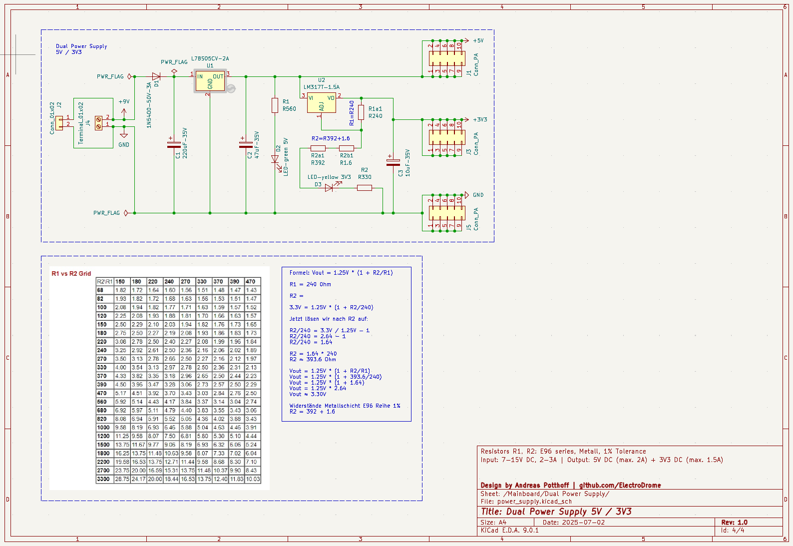

# 🔋 power_supply – Dual Voltage Supply (5 V & 3.3 V)

This module provides a stable, linear-regulated dual voltage supply for the `core65x` mainboard and peripheral ecosystem. It offers both +5 V and +3.3 V output rails using standard TO-220 regulators.

---

## ⚙️ Features

- ✅ +5 V fixed output (e.g., 7805 or similar)
- ✅ +3.3 V adjustable via LM317 (preset using R1/R2 resistors)
- ✅ Input voltage: 7–12 V DC
- ✅ Fully linear, quiet — ideal for mixed analog/digital systems
- ✅ Compact layout, modular interface
- ✅ TO-220 footprint with heatsink option
- ✅ Supports 5 V logic cores and 3.3 V peripherals simultaneously

---

## 🔧 Technical Overview

| Parameter            | Value                                 |
|----------------------|----------------------------------------|
| Input Voltage        | 7 V to 12 V DC                          |
| Output 1             | +5 V via fixed regulator (L78S05CV-2A)  |
| Output 2             | +3.3 V via LM317T-1.5A adjustable regulator  |
| Max Output Current   | 5 V: up to 2 A · 3.3 V: up to 1.5 A     |
| Regulation Type      | Linear                                 |
| Cooling              | Heatsink recommended for >500 mA load  |
| Mounting             | Through-hole · TO-220 packages         |
| Output Connectors    | Screw terminals / pin headers          |

---

## 📐 LM317 Output Voltage Formula

The LM317 regulates its output based on two resistors:

> \( V_\text{OUT} = 1.25\,\text{V} \cdot \left(1 + \frac{R_2}{R_1} \right) \)

Example calculation for 3.3 V:

- R₁ = 240 Ω  
- R₂ ≈ 390 Ω  
- Result: \( V_\text{OUT} \approx 3.3\,\text{V} \)

---

## 🧩 Integration in `core65x`

| Field             | Description                              |
|------------------|------------------------------------------|
| Module Name       | `power_supply`                           |
| Board             | Mainboard                                |
| Status            | ✅ Active                                 |
| Provides          | System-wide +5 V and +3.3 V rails        |
| Upstream Supply   | Barrel jack or external DC input         |
| Downstream Loads  | All logic, MCU, DAC, memory, displays…   |
| Location in Repo  | `hardware/mainboard/modules/power_supply.*` |

---
