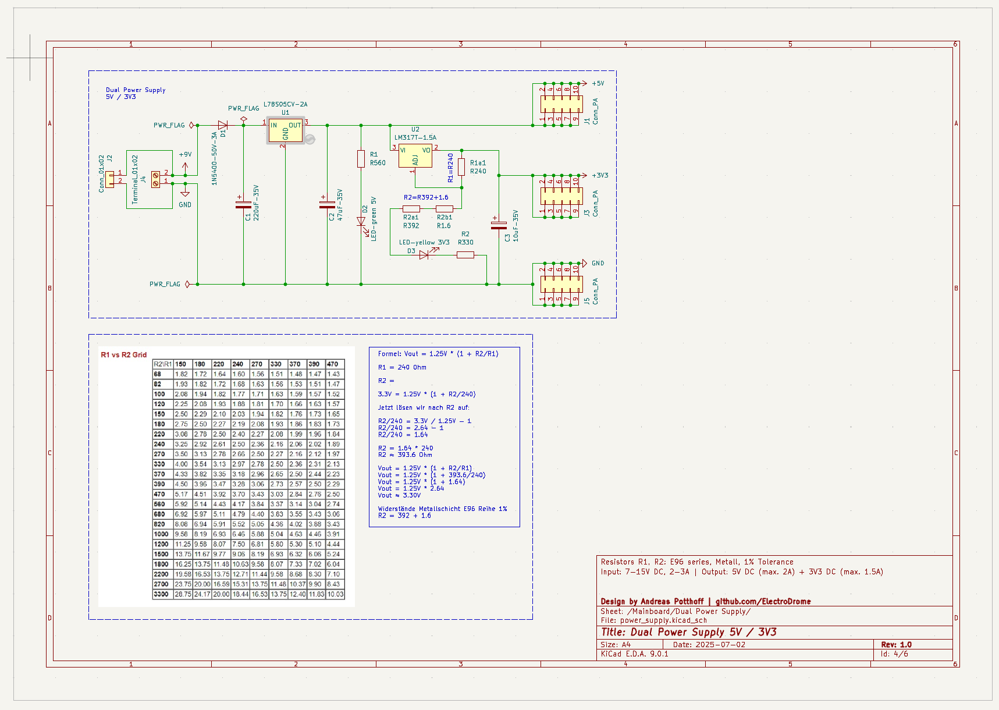

# 🔋 power_supply – Dual Voltage Supply (5 V & 3.3 V)

This module provides a stable, linear-regulated dual voltage supply for the `Core65X` mainboard and peripheral ecosystem. It offers both +5 V and +3.3 V output rails using standard TO-220 regulators.

---

## ⚙️ Features

- ✅ +5 V fixed output (78S05 or similar)
- ✅ +3.3 V adjustable via LM317 (preset using R1/R2 resistors)
- ✅ Input voltage: 7–12 V DC
- ✅ Fully linear, quiet — ideal for mixed analog/digital systems
- ✅ Compact layout, modular interface
- ✅ TO-220 footprint with heatsink option
- ✅ Supports 5 V logic cores and 3.3 V peripherals simultaneously

---

## 🔧 Technical Overview

| Parameter          | Value                                       |
|--------------------|---------------------------------------------|
| Input Voltage      | 7 V to 12 V DC                              |
| Output 1           | +5 V via fixed regulator (L78S05CV-2A)      |
| Output 2           | +3.3 V via LM317T-1.5A adjustable regulator |
| Max Output Current | 5 V: up to 2 A · 3.3 V: up to 1.5 A         |
| Regulation Type    | Linear                                      |
| Cooling            | Heatsink recommended for >500 mA load       |
| Mounting           | Through-hole · TO-220 packages              |
| Output Connectors  | Screw terminals / pin headers               |
| Provides           | System-wide +5 V and +3.3 V rails           |
| Upstream Supply    | Barrel jack or external DC input            |
| Downstream Loads   | All logic, MCU, DAC, memory, displays…      |

---

## 📐 LM317 Output Voltage Formula

The LM317 regulates its output based on two resistors:

Formula: Vout = 1.25V * (1 + R2/R1)

R1 = 240 Ω\
R2 = ?

3.3V = 1.25V * (1 + R2/240)

R2/240 = 3.3V / 1.25V - 1\
R2/240 = 2.64 - 1\
R2/240 = 1.64

R2 = 1.64 * 240\
R2 ≈ 393.6 Ω

Vout = 1.25V * (1 + R2/R1)\
Vout = 1.25V * (1 + 393.6/240)\
Vout = 1.25V * (1 + 1.64)\
Vout = 1.25V * 2.64\
Vout ≈ 3.30V

R2 = 392 + 1.6 = 393.6 Ω

Resistors R1a1 (240 Ohm), R2a1 (392 Ohm), R2a2 (1.6 Ohm): E96 series, Metall, 1% Tolerance

---

## Measurements

### Test setup

Measured output voltages
Vin: 9V
Vout 5V : 5.079
Vout 3v3: 3.314

### Core65X PCB setup

Measured output voltages
Vin: 9V
Vout 5V : pending
Vout 3V3: pending

## BOM

| Qty | Component Type         | Value / Description | Properties / Notes       | Package  | Manufacturer Part # | Mouser #     | Reichelt #     |   |   |
|-----|------------------------|---------------------|--------------------------|----------|---------------------|--------------|----------------|---|---|
| 2   | LED Resistor           | 1 kΩ                | Carbon, E24, 250 mW, 5%  | 0207     | CFR-25JT-52-1K      |              | 1/4W 1,0K      |   |   |
| 1   | Voltage Regulator      | L78S05CV            | Fixed +5 V, 2 A          | TO-220   | L78S05CV            | 511-L78S05CV | µA 78S05       |   |   |
| 1   | Voltage Regulator      | LM317T              | Adjustable +3.3 V, 1.5 A | TO-220   | LM317T              | 926-LM317T   | LM 317-220 SG  |   |   |
| 1   | Electrolytic Capacitor | 220 µF / 35 V       | Axial                    | Axial    |                     |              | RAD 220/35     |   |   |
| 1   | Electrolytic Capacitor | 47 µF / 35 V        | Axial                    | Axial    |                     |              | RAD 47/35      |   |   |
| 1   | Electrolytic Capacitor | 10 µF / 35 V        | Axial                    | Axial    |                     |              | RAD 10/35      |   |   |
| 1   | LED 5 V Indicator      | Green LED 3.3 V     | 3 mm, green              | THT      |                     |              | LED 3MM GN     |   |   |
| 1   | LED 3.3V Indicator     | Yellow LED 3.3 V    | 3 mm, yellow             | THT      |                     |              | LED 3MM GE     |   |   |
| 1   | Diode                  | 1N5400              | 50 V, 3 A, axial         | DO-201AD | 1N5400              | 583-1N5400   | 1N 5400        |   |   |
